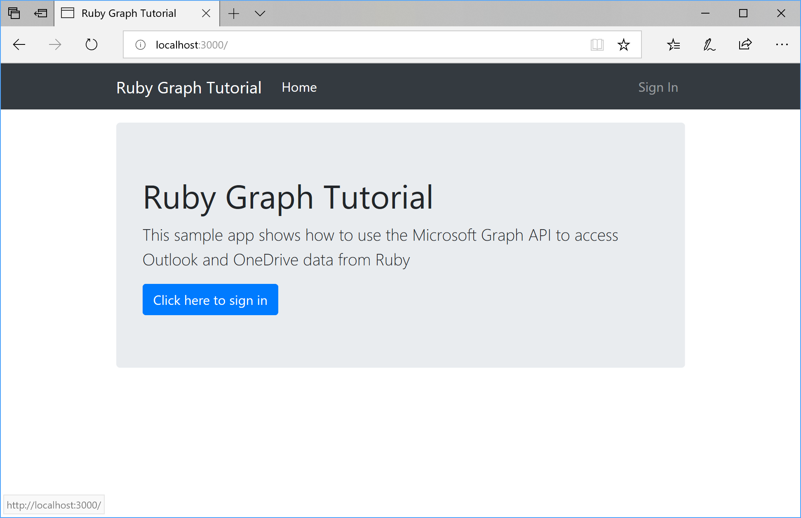

<!-- markdownlint-disable MD002 MD041 -->

<span data-ttu-id="ceb65-101">この演習では、 [Ruby On Rails](https://rubyonrails.org/)を使用して web アプリを構築します。</span><span class="sxs-lookup"><span data-stu-id="ceb65-101">In this exercise you will use [Ruby on Rails](https://rubyonrails.org/) to build a web app.</span></span>

1. <span data-ttu-id="ceb65-102">Rails がまだインストールされていない場合は、コマンドラインインターフェイス (CLI) から次のコマンドを使用してインストールできます。</span><span class="sxs-lookup"><span data-stu-id="ceb65-102">If you don't already have Rails installed, you can install it from your command-line interface (CLI) with the following command.</span></span>

    ```Shell
    gem install rails -v 6.0.2.2
    ```

1. <span data-ttu-id="ceb65-103">CLI を開き、ファイルを作成する権限があるディレクトリに移動し、次のコマンドを実行して新しい Rails アプリを作成します。</span><span class="sxs-lookup"><span data-stu-id="ceb65-103">Open your CLI, navigate to a directory where you have rights to create files, and run the following command to create a new Rails app.</span></span>

    ```Shell
    rails new graph-tutorial
    ```

1. <span data-ttu-id="ceb65-104">この新しいディレクトリに移動し、次のコマンドを入力してローカル web サーバーを開始します。</span><span class="sxs-lookup"><span data-stu-id="ceb65-104">Navigate to this new directory and enter the following command to start a local web server.</span></span>

    ```Shell
    rails server
    ```

1. <span data-ttu-id="ceb65-105">ブラウザーを開き、`http://localhost:3000` に移動します。</span><span class="sxs-lookup"><span data-stu-id="ceb65-105">Open your browser and navigate to `http://localhost:3000`.</span></span> <span data-ttu-id="ceb65-106">すべてが動作している場合は、"Yay!" と表示されます。</span><span class="sxs-lookup"><span data-stu-id="ceb65-106">If everything is working, you will see a "Yay!</span></span> <span data-ttu-id="ceb65-107">レールを使用しています。</span><span class="sxs-lookup"><span data-stu-id="ceb65-107">You're on Rails!"</span></span> <span data-ttu-id="ceb65-108">メッセージ。</span><span class="sxs-lookup"><span data-stu-id="ceb65-108">message.</span></span> <span data-ttu-id="ceb65-109">このメッセージが表示されない場合は、 [Rails の入門ガイド](http://guides.rubyonrails.org/)を確認してください。</span><span class="sxs-lookup"><span data-stu-id="ceb65-109">If you don't see that message, check the [Rails getting started guide](http://guides.rubyonrails.org/).</span></span>

## <a name="install-gems"></a><span data-ttu-id="ceb65-110">Gem をインストールする</span><span class="sxs-lookup"><span data-stu-id="ceb65-110">Install gems</span></span>

<span data-ttu-id="ceb65-111">に進む前に、後で使用する gem をいくつかインストールします。</span><span class="sxs-lookup"><span data-stu-id="ceb65-111">Before moving on, install some additional gems that you will use later:</span></span>

- <span data-ttu-id="ceb65-112">[omniauth-](https://github.com/omniauth/omniauth-oauth2)サインインおよび OAuth トークンフローを処理するための oauth2。</span><span class="sxs-lookup"><span data-stu-id="ceb65-112">[omniauth-oauth2](https://github.com/omniauth/omniauth-oauth2) for handling sign-in and OAuth token flows.</span></span>
- <span data-ttu-id="ceb65-113">[omniauth-](https://github.com/cookpad/omniauth-rails_csrf_protection) csrf 保護を omniauth に追加するために rails_csrf_protection します。</span><span class="sxs-lookup"><span data-stu-id="ceb65-113">[omniauth-rails_csrf_protection](https://github.com/cookpad/omniauth-rails_csrf_protection) for adding CSRF protection to OmniAuth.</span></span>
- <span data-ttu-id="ceb65-114">Microsoft Graph に電話をかけるための[httparty](https://github.com/jnunemaker/httparty) 。</span><span class="sxs-lookup"><span data-stu-id="ceb65-114">[httparty](https://github.com/jnunemaker/httparty) for making calls to Microsoft Graph.</span></span>
- <span data-ttu-id="ceb65-115">の場合は、データベースにセッションを格納するための[session_store](https://github.com/rails/activerecord-session_store)ます。</span><span class="sxs-lookup"><span data-stu-id="ceb65-115">[activerecord-session_store](https://github.com/rails/activerecord-session_store) for storing sessions in the database.</span></span>

1. <span data-ttu-id="ceb65-116">**/Gemfile**を開き、次の行を追加します。</span><span class="sxs-lookup"><span data-stu-id="ceb65-116">Open **./Gemfile** and add the following lines.</span></span>

    :::code language="ruby" source="../demo/graph-tutorial/Gemfile" id="GemFileSnippet":::

1. <span data-ttu-id="ceb65-117">CLI で、次のコマンドを実行します。</span><span class="sxs-lookup"><span data-stu-id="ceb65-117">In your CLI, run the following command.</span></span>

    ```Shell
    bundle install
    ```

1. <span data-ttu-id="ceb65-118">CLI で、次のコマンドを実行して、セッションを格納するようにデータベースを構成します。</span><span class="sxs-lookup"><span data-stu-id="ceb65-118">In your CLI, run the following commands to configure the database for storing sessions.</span></span>

    ```Shell
    rails generate active_record:session_migration
    rake db:migrate
    ```

1. <span data-ttu-id="ceb65-119">`session_store.rb` **./Config/イニシャライザー**ディレクトリに新しいファイルを作成し、次のコードを追加します。</span><span class="sxs-lookup"><span data-stu-id="ceb65-119">Create a new file called `session_store.rb` in the **./config/initializers** directory, and add the following code.</span></span>

    :::code language="ruby" source="../demo/graph-tutorial/config/initializers/session_store.rb" id="SessionStoreSnippet":::

## <a name="design-the-app"></a><span data-ttu-id="ceb65-120">アプリを設計する</span><span class="sxs-lookup"><span data-stu-id="ceb65-120">Design the app</span></span>

<span data-ttu-id="ceb65-121">このセクションでは、アプリの基本的な UI を作成します。</span><span class="sxs-lookup"><span data-stu-id="ceb65-121">In this section you'll create the basic UI for the app.</span></span>

1. <span data-ttu-id="ceb65-122">**/App/views/layouts/application.html.erb**を開き、その内容を次のように置き換えます。</span><span class="sxs-lookup"><span data-stu-id="ceb65-122">Open **./app/views/layouts/application.html.erb** and replace its contents with the following.</span></span>

    :::code language="html" source="../demo/graph-tutorial/app/views/layouts/application.html.erb" id="LayoutSnippet":::

    <span data-ttu-id="ceb65-123">このコードはシンプルなスタイルのために [Bootstrap](http://getbootstrap.com/) を追加し、シンプルなアイコンのために [Font Awesome](https://fontawesome.com/) を追加します。</span><span class="sxs-lookup"><span data-stu-id="ceb65-123">This code adds [Bootstrap](http://getbootstrap.com/) for simple styling, and [Font Awesome](https://fontawesome.com/) for some simple icons.</span></span> <span data-ttu-id="ceb65-124">また、ナビゲーションバーのあるグローバルレイアウトを定義します。</span><span class="sxs-lookup"><span data-stu-id="ceb65-124">It also defines a global layout with a nav bar.</span></span>

1. <span data-ttu-id="ceb65-125">**/App/assets/stylesheets/application.css**を開き、ファイルの末尾に次のものを追加します。</span><span class="sxs-lookup"><span data-stu-id="ceb65-125">Open **./app/assets/stylesheets/application.css** and add the following to the end of the file.</span></span>

    :::code language="css" source="../demo/graph-tutorial/app/assets/stylesheets/application.css" id="CssSnippet":::

1. <span data-ttu-id="ceb65-126">次のコマンドを使用して、ホームページコントローラーを生成します。</span><span class="sxs-lookup"><span data-stu-id="ceb65-126">Generate a home page controller with the following command.</span></span>

    ```Shell
    rails generate controller Home index
    ```

1. <span data-ttu-id="ceb65-127">`Home`コントローラーの`index`アクションをアプリの既定のページとして構成します。</span><span class="sxs-lookup"><span data-stu-id="ceb65-127">Configure the `index` action on the `Home` controller as the default page for the app.</span></span> <span data-ttu-id="ceb65-128">/Config/routes.rb を開き、そのコンテンツを次のように置き換え**ます。**</span><span class="sxs-lookup"><span data-stu-id="ceb65-128">Open **./config/routes.rb** and replace its contents with the following</span></span>

    ```ruby
    Rails.application.routes.draw do
      get 'home/index'
      root 'home#index'

      # Add future routes here

    end
    ```

1. <span data-ttu-id="ceb65-129">**/App/view/home/index.html.erb**を開き、その内容を次のように置き換えます。</span><span class="sxs-lookup"><span data-stu-id="ceb65-129">Open **./app/view/home/index.html.erb** and replace its contents with the following.</span></span>

    :::code language="html" source="../demo/graph-tutorial/app/views/home/index.html.erb" id="HomeSnippet":::

1. <span data-ttu-id="ceb65-130">変更内容をすべて保存し、サーバーを再起動します。</span><span class="sxs-lookup"><span data-stu-id="ceb65-130">Save all of your changes and restart the server.</span></span> <span data-ttu-id="ceb65-131">この時点で、アプリの外観は大きく異なります。</span><span class="sxs-lookup"><span data-stu-id="ceb65-131">Now, the app should look very different.</span></span>

    
