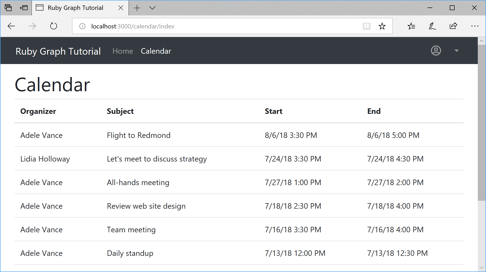

<!-- markdownlint-disable MD002 MD041 -->

<span data-ttu-id="49f7b-101">この演習では、Microsoft Graph をアプリケーションに組み込みます。</span><span class="sxs-lookup"><span data-stu-id="49f7b-101">In this exercise you will incorporate the Microsoft Graph into the application.</span></span> <span data-ttu-id="49f7b-102">このアプリケーションでは、 [httparty](https://github.com/jnunemaker/httparty) gem を使用して Microsoft Graph を呼び出すことになります。</span><span class="sxs-lookup"><span data-stu-id="49f7b-102">For this application, you will use the [httparty](https://github.com/jnunemaker/httparty) gem to make calls to Microsoft Graph.</span></span>

## <a name="create-a-graph-helper"></a><span data-ttu-id="49f7b-103">Graph ヘルパーを作成する</span><span class="sxs-lookup"><span data-stu-id="49f7b-103">Create a Graph helper</span></span>

<span data-ttu-id="49f7b-104">すべての API 呼び出しを管理するヘルパーを作成します。</span><span class="sxs-lookup"><span data-stu-id="49f7b-104">Create a helper to manage all of your API calls.</span></span> <span data-ttu-id="49f7b-105">CLI で次のコマンドを実行して、ヘルパーを生成します。</span><span class="sxs-lookup"><span data-stu-id="49f7b-105">Run the following command in your CLI to generate the helper.</span></span>

```Shell
rails generate helper Graph
```

<span data-ttu-id="49f7b-106">新しく作成`./app/helpers/graph_helper.rb`したファイルを開き、コンテンツを次のように置き換えます。</span><span class="sxs-lookup"><span data-stu-id="49f7b-106">Open the newly created `./app/helpers/graph_helper.rb` file and replace the contents with the following.</span></span>

```ruby
require 'httparty'

# Graph API helper methods
module GraphHelper
  GRAPH_HOST = 'https://graph.microsoft.com'.freeze

  def make_api_call(endpoint, token, params = nil)
    headers = {
      Authorization: "Bearer #{token}"
    }

    query = params || {}

    HTTParty.get "#{GRAPH_HOST}#{endpoint}",
                 headers: headers,
                 query: query
  end
end
```

<span data-ttu-id="49f7b-107">このコードの内容を確認してください。</span><span class="sxs-lookup"><span data-stu-id="49f7b-107">Take a moment to review what this code does.</span></span> <span data-ttu-id="49f7b-108">このメソッドは、要求された`httparty`エンドポイントに対して gem を使用して、簡単な GET 要求を作成します。</span><span class="sxs-lookup"><span data-stu-id="49f7b-108">It makes a simple GET request via the `httparty` gem to the requested endpoint.</span></span> <span data-ttu-id="49f7b-109">このメソッドは、 `Authorization`ヘッダーにアクセストークンを送信し、渡されたすべてのクエリパラメーターを含みます。</span><span class="sxs-lookup"><span data-stu-id="49f7b-109">It sends the access token in the `Authorization` header, and it includes any query parameters that are passed.</span></span>

<span data-ttu-id="49f7b-110">たとえば、 `make_api_call`メソッドを使用して GET を`https://graph.microsoft.com/v1.0/me?$select=displayName`実行するには、次のように呼び出すことができます。</span><span class="sxs-lookup"><span data-stu-id="49f7b-110">For example, to use the `make_api_call` method to do a GET to `https://graph.microsoft.com/v1.0/me?$select=displayName`, you could call it like so:</span></span>

```ruby
make_api_call `/v1.0/me`, access_token, { '$select': 'displayName' }
```

<span data-ttu-id="49f7b-111">この後、より多くの Microsoft Graph 機能をアプリに実装する際に、これに基づいて構築します。</span><span class="sxs-lookup"><span data-stu-id="49f7b-111">You'll build on this later as you implement more Microsoft Graph features into the app.</span></span>

## <a name="get-calendar-events-from-outlook"></a><span data-ttu-id="49f7b-112">Outlook から予定表のイベントを取得する</span><span class="sxs-lookup"><span data-stu-id="49f7b-112">Get calendar events from Outlook</span></span>

<span data-ttu-id="49f7b-113">まず、ユーザーの予定表でイベントを表示する機能を追加します。</span><span class="sxs-lookup"><span data-stu-id="49f7b-113">Let's start by adding the ability to view events on the user's calendar.</span></span> <span data-ttu-id="49f7b-114">CLI で、次のコマンドを実行して新しいコントローラーを追加します。</span><span class="sxs-lookup"><span data-stu-id="49f7b-114">In your CLI, run the following command to add a new controller.</span></span>

```Shell
rails generate controller Calendar index
```

<span data-ttu-id="49f7b-115">これでルートを使用できるようになりました。これを使用する`./app/view/layouts/application.html.erb`には、のナビゲーションバーにある**予定表**のリンクを更新します。</span><span class="sxs-lookup"><span data-stu-id="49f7b-115">Now that we have the route available, update the **Calendar** link in the navbar in `./app/view/layouts/application.html.erb` to use it.</span></span> <span data-ttu-id="49f7b-116">行`<a class="nav-link" href="#">Calendar</a>`を次のように置き換えます。</span><span class="sxs-lookup"><span data-stu-id="49f7b-116">Replace the line `<a class="nav-link" href="#">Calendar</a>` with the following.</span></span>

```html
<%= link_to "Calendar", {:controller => :calendar, :action => :index}, class: "nav-link#{' active' if controller.controller_name == 'calendar'}" %>
```

<span data-ttu-id="49f7b-117">Graph ヘルパーに新しいメソッドを追加して、[ユーザーのイベントを一覧表示](https://developer.microsoft.com/en-us/graph/docs/api-reference/v1.0/api/user_list_events)します。</span><span class="sxs-lookup"><span data-stu-id="49f7b-117">Add a new method to the Graph helper to [list the user's events](https://developer.microsoft.com/en-us/graph/docs/api-reference/v1.0/api/user_list_events).</span></span> <span data-ttu-id="49f7b-118">を`./app/helpers/graph_helper.rb`開き、 `GraphHelper`モジュールに次のメソッドを追加します。</span><span class="sxs-lookup"><span data-stu-id="49f7b-118">Open `./app/helpers/graph_helper.rb` and add the following method to the `GraphHelper` module.</span></span>

```ruby
def get_calendar_events(token)
  get_events_url = '/v1.0/me/events'

  query = {
    '$select': 'subject,organizer,start,end',
    '$orderby': 'createdDateTime DESC'
  }

  response = make_api_call get_events_url, token, query

  raise response.parsed_response.to_s || "Request returned #{response.code}" unless response.code == 200
  response.parsed_response['value']
end
```

<span data-ttu-id="49f7b-119">このコードの内容を検討してください。</span><span class="sxs-lookup"><span data-stu-id="49f7b-119">Consider what this code is doing.</span></span>

- <span data-ttu-id="49f7b-120">呼び出し先の URL は`/v1.0/me/events`になります。</span><span class="sxs-lookup"><span data-stu-id="49f7b-120">The URL that will be called is `/v1.0/me/events`.</span></span>
- <span data-ttu-id="49f7b-121">パラメーター `$select`は、各イベントに対して返されるフィールドを、ビューが実際に使用するものだけに制限します。</span><span class="sxs-lookup"><span data-stu-id="49f7b-121">The `$select` parameter limits the fields returned for each events to just those our view will actually use.</span></span>
- <span data-ttu-id="49f7b-122">パラメーター `$orderby`は、生成された日付と時刻で結果を並べ替えます。最新のアイテムが最初に表示されます。</span><span class="sxs-lookup"><span data-stu-id="49f7b-122">The `$orderby` parameter sorts the results by the date and time they were created, with the most recent item being first.</span></span>
- <span data-ttu-id="49f7b-123">正常な応答の場合は、 `value`キーに含まれている項目の配列を返します。</span><span class="sxs-lookup"><span data-stu-id="49f7b-123">For a successful response, it returns the array of items contained in the `value` key.</span></span>

<span data-ttu-id="49f7b-124">これで、これをテストできます。</span><span class="sxs-lookup"><span data-stu-id="49f7b-124">Now you can test this.</span></span> <span data-ttu-id="49f7b-125">この`./app/controllers/calendar_controller.rb`メソッドを呼び出し`index`て結果を表示するアクションを開いて更新します。</span><span class="sxs-lookup"><span data-stu-id="49f7b-125">Open `./app/controllers/calendar_controller.rb` and update the `index` action to call this method and render the results.</span></span>

```ruby
# Calendar controller
class CalendarController < ApplicationController
  include GraphHelper

  def index
    @events = get_calendar_events access_token || []
    render json: @events
  rescue RuntimeError => e
    @errors = [
      {
        message: 'Microsoft Graph returned an error getting events.',
        debug: e
      }
    ]
  end
end
```

<span data-ttu-id="49f7b-126">サーバーを再起動します。</span><span class="sxs-lookup"><span data-stu-id="49f7b-126">Restart the server.</span></span> <span data-ttu-id="49f7b-127">サインインして、ナビゲーションバーの [**予定表**] リンクをクリックします。</span><span class="sxs-lookup"><span data-stu-id="49f7b-127">Sign in and click the **Calendar** link in the nav bar.</span></span> <span data-ttu-id="49f7b-128">すべてが動作する場合は、ユーザーの予定表にイベントの JSON ダンプが表示されます。</span><span class="sxs-lookup"><span data-stu-id="49f7b-128">If everything works, you should see a JSON dump of events on the user's calendar.</span></span>

## <a name="display-the-results"></a><span data-ttu-id="49f7b-129">結果を表示する</span><span class="sxs-lookup"><span data-stu-id="49f7b-129">Display the results</span></span>

<span data-ttu-id="49f7b-130">これで、HTML と CSS を追加して、よりわかりやすい方法で結果を表示することができます。</span><span class="sxs-lookup"><span data-stu-id="49f7b-130">Now you can add HTML and CSS to display the results in a more user-friendly manner.</span></span>

<span data-ttu-id="49f7b-131">を`./app/views/calendar/index.html.erb`開き、その内容を次のように置き換えます。</span><span class="sxs-lookup"><span data-stu-id="49f7b-131">Open `./app/views/calendar/index.html.erb` and replace its contents with the following.</span></span>

```html
<h1>Calendar</h1>
<table class="table">
  <thead>
    <tr>
      <th scope="col">Organizer</th>
      <th scope="col">Subject</th>
      <th scope="col">Start</th>
      <th scope="col">End</th>
    </tr>
  </thead>
  <tbody>
    <% @events.each do |event| %>
      <tr>
        <td><%= event['organizer']['emailAddress']['name'] %></td>
        <td><%= event['subject'] %></td>
        <td><%= event['start']['dateTime'].to_time(:utc).localtime.strftime('%-m/%-d/%y %l:%M %p') %></td>
        <td><%= event['end']['dateTime'].to_time(:utc).localtime.strftime('%-m/%-d/%y %l:%M %p') %></td>
      </tr>
    <% end %>
  </tbody>
</table>
```

<span data-ttu-id="49f7b-132">これにより、イベントのコレクションをループ処理して、テーブル行を1つずつ追加します。</span><span class="sxs-lookup"><span data-stu-id="49f7b-132">That will loop through a collection of events and add a table row for each one.</span></span> <span data-ttu-id="49f7b-133">`index`の`./app/controllers/calendar_controller.rb`アクション`render json: @events`から行を削除すると、アプリがイベントの表を表示するはずです。</span><span class="sxs-lookup"><span data-stu-id="49f7b-133">Remove the `render json: @events` line from the `index` action in `./app/controllers/calendar_controller.rb` and the app should now render a table of events.</span></span>

